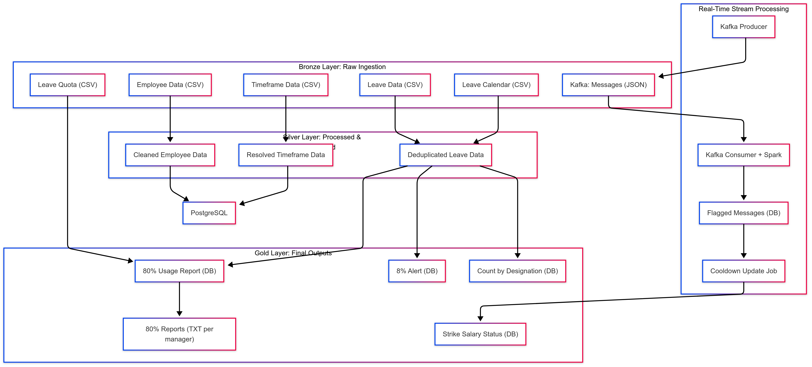
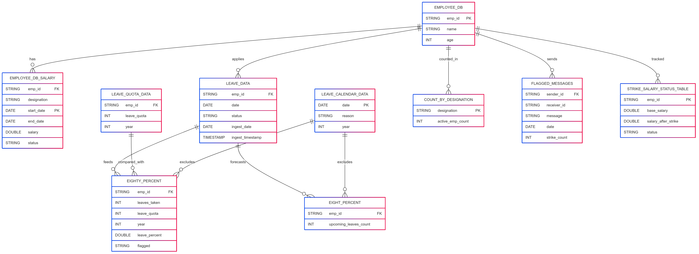

# Employee Data Management System

## ARCHITECTURE



## 🚀 Project Overview

The **Employee Data Management System** is a scalable data engineering project built on AWS to automate the ingestion, processing, and monitoring of employee data. It leverages batch pipelines (daily/yearly) and real-time Kafka streams to track employee activity, generate insightful reports, and detect misuse of organizational policies.

---

## 📌 Business Goals

* Efficient management of employee records and updates.
* Track and analyze employee leave patterns.
* Detect excessive leave usage and communication abuse.
* Support HR decisions through automated reporting.

---

## 🗃️ Data Sources

| Source                             | Format | Frequency           |
| ---------------------------------- | ------ | ------------------- |
| `employee_data.csv`                | CSV    | Daily               |
| `employee_timeframe_data.csv`      | CSV    | Daily (Incremental) |
| `employee_leave_quota_data.csv`    | CSV    | Yearly              |
| `employee_leave_calendar_data.csv` | CSV    | Yearly (Jan 1st)    |
| `employee_leave_data.csv`          | CSV    | Daily at 7:00 UTC   |
| Kafka Stream                       | JSON   | Real-time           |
| `marked_word.json`, `vocab.json`   | JSON   | Static              |

---

## 🛠️ System Architecture & Processing

### 🔹 1. Employee Master Table

* **Append-only table**
* Stores `employee_id`, `age`, `name`
* Scheduled daily at **7:00 UTC**

### 🔹 2. Employee Timeframe Table

* Handles salary/designation changes over time
* Ensures **continuity**, removes **duplicates**
* Flags: `ACTIVE` / `INACTIVE`
* Final data goes to:

  * `employee_db_salary` (overwrite)
  * `final_emp_timframe_table` (append - historical backup)

### 🔹 3. Leave Management

* **Leave Quota + Calendar** → Yearly append-only tables
* **Leave Applications** → Daily updated table

### 🔹 4. Reports

* **Daily**: Active employees by designation
* **Daily**: Leave usage exceeding 8% of working days
* **Monthly**: >80% leave quota users → text reports for managers (no emails)

### 🔹 5. Communication Monitoring (Streaming via Kafka)

* Monitors flagged words from `marked_word.json`
* Tracks message history + strike count
* **Salary Deduction**: 10% per flagged message
* **Cooldown**: Monthly reset (excluding users with 10+ strikes)

---

## 💻 Tech Stack

* **AWS S3**: Storage of CSVs
* **Kafka**: Real-time communication monitoring
* **AWS Glue / PySpark**: ETL
* **PostgreSQL on EC2**: Staging and final DB
* **Parquet**: Intermediate data format

---

## 📈 Success Metrics

* ✅ Daily/Yearly data ingestion
* ✅ Accurate leave tracking & quota calculations
* ✅ Real-time communication abuse detection
* ✅ Monthly/adhoc reports generated reliably

---

## 📉 Limitations

* ❌ No email alerts or notifications implemented
* ❌ External integration beyond data & reporting not included

---

## 📊 ER Diagram



---

## 📂 Folder Structure

```
├── data/
├── scripts/
│   ├── etl_jobs/
│   └── kafka_stream/
├── reports/
├── utils/
└── README.md
```

---

## 👤 Author

**Priyansh Gupta**
📧 [shishusha922@gmail.com](mailto:guptapriyansh646@gmail.com)
🔗 [LinkedIn](https://www.linkedin.com/in/priyansh-gupta-b30b18241/)
🔗 [GitHub](https://github.com/priyansg01)

---

## 📌 To Do (Future Scope)

* Enable email notifications for monthly reports
* Expand Kafka monitoring to include attachments and sentiment analysis
* Build a dashboard for HRs to visualize trends

---
